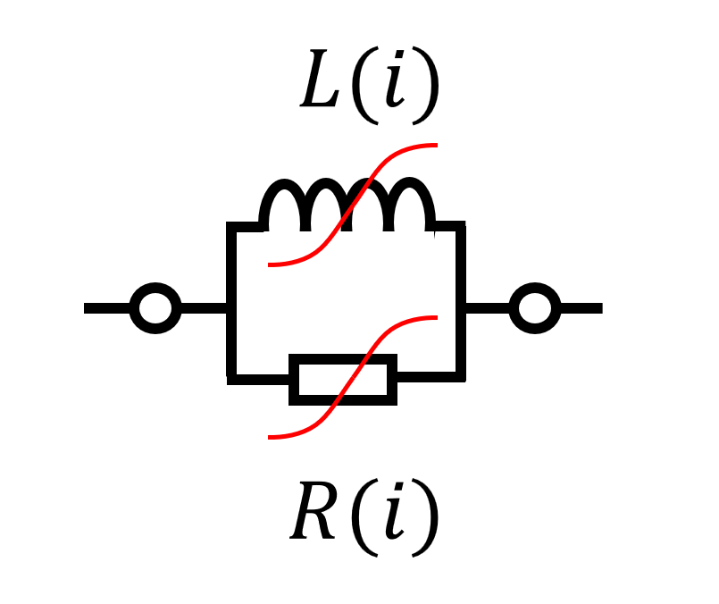
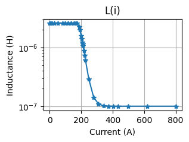
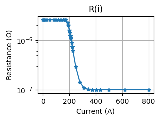
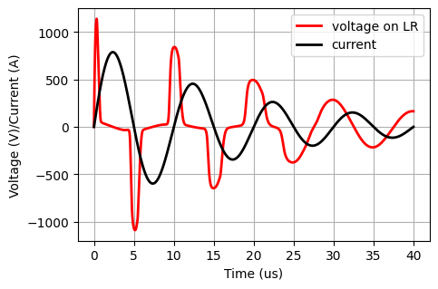

  
 
# Overview
## What is nLRSpice Lib?

This library provides procedures for building SPICE code for nonlinear LR elements. 

## What are the main features ?

This library allows you to create SPICE code for a pair of nonlinear LR elements.

## Example

The repository also includes an example of code usage and a transient simulation using the NGSpice engine and the PySpice library.

The simulation utilizes two L(i) amd R(i) models to achieve an impedance function similar to the impedance of a magnetic ring.

  

The result of Spice simulation:
 

## References

Do you like the library? Please cite:

[1] Kutorasinski, K., Pawłowski, J., Molas, M., & Szewczyk, M. (2025). Nonlinear Magnetic Ring Model: From Impedance Measurements to Time Domain Simulations. XXX, XXX 

[2] Leszczynski, P., Kutorasinski, K., Szewczyk, M., & Pawłowski, J. (2024). Machine-Learned Models for Power Magnetic Material Characteristics. IEEE Transactions on Power Electronics.
[https://ieeexplore.ieee.org/document/10684126](https://ieeexplore.ieee.org/document/10684126)

[3] Kutorasiński, K., Pawłowski, J., Leszczyński, P., & Szewczyk, M. (2023). Nonlinear modeling of magnetic materials for circuit simulations. Scientific Reports, 13(1), 17178.
[https://www.nature.com/articles/s41598-023-44187-3](https://www.nature.com/articles/s41598-023-44187-3)

 

## Requirement

To run simulation PySpice with ngspice is needed. Raw spice netlist as txt file can be generated without simulation and PySpice.

## History

V0.91 - 1.2025 (development release)
 * Added an example to show how to use with the NgSpice with Pyspice.

V0.9 - 2024 (development release)
 * Started project 
 

