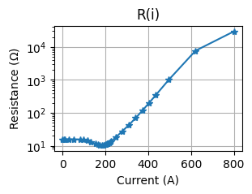
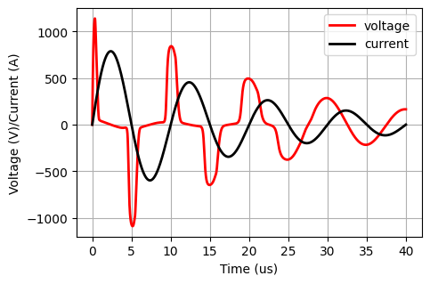

# Overview
## What is NonLinearDev Lib?

Ta biblioteka dostarcza procedury do budowania kodu SPICE dla nieliniowych elementów LR. 

## Reference

Do you like the library? Please cite:

Kutorasiński, K., Pawłowski, J., Leszczyński, P., & Szewczyk, M. (2023). Nonlinear modeling of magnetic materials for circuit simulations. Scientific Reports, 13(1), 17178.

Leszczynski, P., Kutorasinski, K., Szewczyk, M., & Pawłowski, J. (2024). Machine-Learned Models for Power Magnetic Material Characteristics. IEEE Transactions on Power Electronics.

Kutorasinski, K., Pawłowski, J., Molas, M., & Szewczyk, M. (2025). Nonlinear Magnetic Ring Model: From Impedance Measurements to Time Domain Simulations. XXX, XXX

## What are the main features ?

Dzieki tej bibliotece można stowrzyć kod SPICE dla pary nieliniowych elementów LR. 

## Example

Repozytorium zawiera także przykłąd uzycia kodu i symulacje transien przy uzyciu silnika NGSpice oraz biblioteki PySpice

Simulation use two L(i) and R(i) model to have the impedance function similar to impedance of magnetic ring.

  

The result of Spice simulation

V0.91 (development release)
 * Added an example to show how to use with the NgSpice with Pyspice.

V0.9 (development release)
 * Started project 

